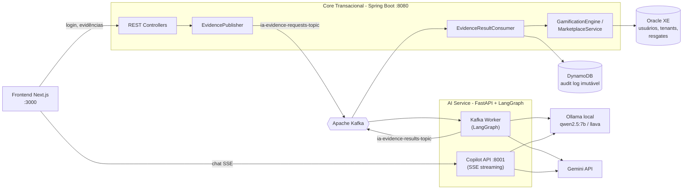
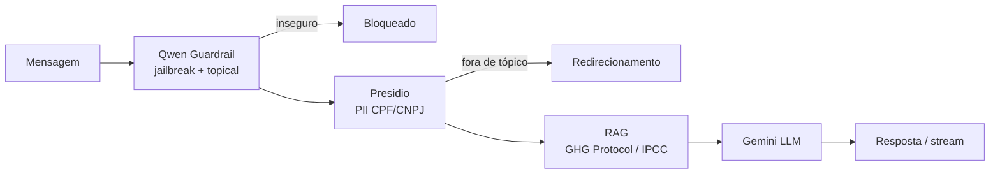

# 🌱 EcoTrack AI — Backend

🔗 **Acesse o repositório do Frontend aqui:** [willarakaki/ecotrack-frontend](https://github.com/willarakaki/ecotrack-frontend)

> **SaaS B2B de ESG** para rastreamento de emissões de **Escopo 3** (deslocamento de colaboradores, home office, resíduos) por meio de **gamificação** e de um **Copiloto de Sustentabilidade** com IA.

O colaborador registra uma ação sustentável (ex.: bilhete de metrô, print de corrida Uber Pool, foto de reciclagem), uma IA audita a evidência (OCR + antifraude), calcula o CO₂ evitado e o sistema converte isso em **EcoCoins**, resgatáveis em um marketplace de recompensas. Gestores (RH/C-Level) acompanham o ROI ESG da empresa.

O frontend está em [`ecotrack-ai-frontend`](../ecotrack-ai-frontend/README.md).

---


## 📊 Impacto Arquitetural & Performance

> **Nota:** Estes números foram extraídos de testes reais de benchmark local na máquina de desenvolvimento.

As escolhas arquiteturais do EcoTrack AI foram focadas em resolver gargalos comuns de aplicações baseadas em IA generativa:

* **Redução de Latência no TTFT (Time-To-First-Token) em 53%:** A requisição padrão do Copiloto bloqueava o client por **~8.3 segundos** (8330ms) aguardando a resposta completa do LLM. Com a implementação de Server-Sent Events (SSE) e Streaming, entregamos o primeiro token em **~3.9 segundos** (3909ms), melhorando drasticamente a percepção de fluidez (UX).
* **Ingestão 10x mais rápida via Apache Kafka:** Ao invés de aguardar o OCR/Validação do modelo na nuvem (que varia entre 2 a 4 segundos) em cada upload de evidência, o backend Java atua como Produtor assíncrono. O endpoint de ingestão processa a request e devolve o protocolo HTTP 202 em apenas **~229ms**.
* **Economia de API (Dual AI Architecture):** O modelo Qwen atua como Gatekeeper local. Requisições fora de contexto ou maliciosas são barradas localmente, reduzindo chamadas inúteis (e custosas) ao Gemini.
* **Resiliência Financeira (Backend):** Uso de *Optimistic Locking* (`@Version`) no banco para impedir *double-spending* na gamificação, abortando ataques de concorrência sem utilizar *locks* pessimistas pesados.

---

## 📑 Sumário

- [A ideia do projeto](#-a-ideia-do-projeto)
- [Arquitetura](#-arquitetura)
- [Estrutura do repositório](#-estrutura-do-repositório)
- [Stack](#-stack)
- [Fluxo de validação de evidência](#-fluxo-de-validação-de-evidência-event-driven)
- [Core Transacional (Java)](#-core-transacional-java--spring-boot)
- [Serviço de IA (Python)](#-serviço-de-ia-python--fastapi--langgraph)
- [Como rodar](#-como-rodar-localmente)
- [Variáveis de ambiente](#-variáveis-de-ambiente)
- [Testes e CI](#-testes-e-ci)
- [Limitações conhecidas](#-limitações-conhecidas--próximos-passos)

---

## 💡 A ideia do projeto

| Persona | Papel (`RoleType`) | O que faz na plataforma |
|---|---|---|
| Colaborador | `EMPLOYEE` | Registra ações, ganha EcoCoins, resgata recompensas, conversa com o Copiloto |
| Gestor de Sustentabilidade / RH | `ADMIN_RH` | Painel gerencial: auditoria de Escopo 3, metas ESG, engajamento, configurações do tenant |
| Diretoria (CFO/CEO) | `C_LEVEL` | Visão de ROI ESG |

Pilares:

1. **Gamificação** — 1 kg de CO₂ poupado = **10 EcoCoins**; níveis, streaks, medalhas, ranking por departamento e metas.
2. **Validação por IA** — a evidência passa por triagem barata (SLM local) e, só se necessário, por auditoria pesada (Gemini). Resultados: `APPROVED`, `REJECTED` ou `FRAUD`.
3. **Copiloto de Sustentabilidade** — chat com RAG sobre GHG Protocol / IPCC, protegido por guardrails e anonimização de PII (LGPD).
4. **Multi-tenant (B2B)** — cada empresa (`Tenant`) tem planos `STANDARD` ou `ENTERPRISE`.
5. **Trilha de auditoria imutável** — toda decisão da IA é gravada no DynamoDB.

---

## 🏗 Arquitetura

Ecossistema híbrido, assíncrono e orientado a eventos.



---

## 📁 Estrutura do repositório

```
ecotrack-ai/
├── docker-compose.yml          # Oracle XE, Kafka (KRaft), DynamoDB Local, AI API + worker
├── .env.example                # Variáveis do compose
├── agent.md                    # Estado/decisões das sprints (contexto para agentes)
├── .github/workflows/
│   └── ai-service-ci.yml       # CI do serviço de IA (flake8, pytest+coverage, docker build)
│
├── core/                       # ☕ Java 21 / Spring Boot 4.1 (Maven)
│   ├── Dockerfile              # Multi-stage (JDK build -> JRE runtime)
│   └── src/main/
│       ├── java/com/ecotrack/
│       │   ├── core/           # Domínio transacional
│       │   │   ├── api/        #   controllers + DTOs (request/response)
│       │   │   ├── config/     #   JpaConfig, Kafka producer
│       │   │   ├── domain/     #   entities (Tenant, User) e enums
│       │   │   ├── exception/  #   BusinessException + GlobalExceptionHandler
│       │   │   ├── messaging/  #   EvidenceSubmittedEvent + EvidencePublisher
│       │   │   ├── repository/ #   Spring Data JPA
│       │   │   └── service/    #   TenantService, UserService
│       │   └── gamification/   # Gamificação e marketplace
│       │       ├── api/        #   MarketplaceController (resgates)
│       │       ├── config/     #   DynamoDbConfig + DynamoDbTableInitializer (dev/test)
│       │       ├── domain/     #   documento DynamoDB, DTOs, entity RewardRedemption
│       │       ├── messaging/  #   EvidenceResultConsumer (Kafka listener)
│       │       ├── repository/ #   sql/ (JPA) e nosql/ (DynamoDB)
│       │       └── service/    #   GamificationEngineService, MarketplaceService
│       └── resources/
│           ├── application.yml
│           └── db/migration/   # Flyway V1..V7
│
└── ai-service/                 # 🐍 Python 3.12 / FastAPI / LangGraph
    ├── Dockerfile              # Por padrão sobe o worker Kafka
    ├── requirements.txt
    ├── app/
    │   ├── main.py             # FastAPI (CORS, /health, rotas)
    │   ├── api/copilot.py      # /api/v1/copilot/chat e /chat/stream (SSE)
    │   ├── core/               # config.py (settings) e llm_factory.py (Factory de LLMs)
    │   ├── agents/             # gatekeeper_node.py (SLM) e nodes.py (Auditor VLM)
    │   ├── orchestrator/       # graph.py (LangGraph) e state.py
    │   ├── messaging/          # consumer.py, producer.py, schemas.py (Kafka)
    │   ├── rag/                # knowledge_base.py e retriever.py (RAG híbrido)
    │   └── security/           # pii_sanitizer, prompt_guard, topical_guard, qwen_guardrail
    └── tests/                  # pytest (api, graph, rag, security, guardrail)
```

---

## 🧰 Stack

| Camada | Tecnologias |
|---|---|
| Core | Java 21, Spring Boot 4.1.1, Spring Data JPA, Flyway, Spring Kafka, Actuator, Bean Validation, Lombok, Resilience4j (config) |
| Dados | Oracle XE 21 (transacional) · DynamoDB (AWS SDK v2 Enhanced Client) para auditoria |
| Mensageria | Apache Kafka 3.9 (modo KRaft) |
| IA | Python 3.12, FastAPI, LangChain, **LangGraph**, Pydantic v2 |
| Modelos | **Gemini** (Flash) para OCR/antifraude e chat · **Ollama** local: `qwen2.5:7b` (guardrail) e `llava` (gatekeeper) |
| Segurança | Microsoft Presidio + spaCy `pt_core_news_sm` (CPF/CNPJ, LGPD), Prompt Guard, Topical Guard |
| Observabilidade | LangSmith (tracing de agentes), Actuator (`health`, `info`, `prometheus`) |
| Testes | JUnit 5, Mockito, Testcontainers (Oracle XE), pytest + pytest-cov |

---

## 🔄 Fluxo de validação de evidência (event-driven)

1. O frontend faz `POST /api/v1/evidences` no Core → resposta imediata **`202 Accepted`**.
2. `EvidencePublisher` publica `EvidenceSubmittedEvent` em **`ia-evidence-requests-topic`**.
3. O **worker Python** (`app.messaging.consumer`) consome e executa o grafo LangGraph:

   ```mermaid
   flowchart LR
       S([Start]) --> G["gatekeeper<br/>Ollama llava"]
       G -->|"evidência lixo"| R1["REJECTED"]
       G -->|"ok / SLM offline"| A["auditor_ia<br/>Gemini VLM + OCR"]
       A --> V{"veredito"}
       V --> OK["APPROVED + CO2 saved"]
       V --> RJ["REJECTED"]
       V --> FR["FRAUD"]
   ```

4. O worker publica `EvidenceResultEvent` em **`ia-evidence-results-topic`**.
5. `EvidenceResultConsumer` (Java) processa o veredito:
   - `APPROVED` → `GamificationEngineService.processReward` credita EcoCoins (`CO₂ × 10`) e soma CO₂ no Oracle, com **Optimistic Locking** (`@Version`) e isolamento `READ_COMMITTED`.
   - `FRAUD` → registra tentativa de fraude (`FRAUD_ATTEMPT_*`), sem crédito.
   - `REJECTED` → registra `REJECTED_*`, sem crédito.
   - Em todos os casos grava a trilha no **DynamoDB** (`esg_action_audit_log`).

**Travas de resiliência**: o gatekeeper falha "aberto" (se o Ollama cair, vai para o Gemini); o auditor falha "fechado" (erro ⇒ `REJECTED`); o consumer Python descarta *poison pills* (DLQ simulada); o consumer Java captura exceções para não travar a partição; `LLMFactory` usa retries e `with_fallbacks`.

---

## ☕ Core Transacional (Java / Spring Boot)

Porta padrão: **8080** · Base path: `/api/v1`

| Método | Rota | Descrição | Status |
|---|---|---|---|
| `POST` | `/auth/login` | Login por e-mail/senha; retorna `token`, `userId`, `tenantId`, `role`, `name`, `email`, `ecoCoins`, `totalCo2Saved` | ✅ funcional (token **mock**) |
| `POST` | `/tenants` | Cria empresa (valida `TenantRequest`, retorna `201` + `Location`) | ✅ |
| `POST` | `/evidences` | Submete evidência → publica no Kafka, retorna `202` | ✅ |
| `POST` | `/marketplace/redemptions` | Resgata recompensa (header `X-User-Id`); valida saldo e grava trilha em `tb_reward_redemption` | ✅ |
| `POST` | `/marketplace/redeem` | Resgate "stub" (apenas loga) | ⚠️ stub |
| `POST` | `/wallet/credit` | Crédito de EcoCoins | ⚠️ stub (apenas loga) |
| `POST` | `/wallet/transfer` | Transferência P2P (elogios entre colegas) | ⚠️ stub (apenas loga) |
| `GET` | `/actuator/health`, `/actuator/info`, `/actuator/prometheus` | Observabilidade | ✅ |

Headers usados pelos endpoints: `X-Tenant-ID`, `X-User-ID` (evidências/wallet) e `X-User-Id` (resgates) — simulam o token decodificado de um API Gateway.

### Modelo de dados

**Oracle** (migrações Flyway em `core/src/main/resources/db/migration`):

| Migração | Conteúdo |
|---|---|
| `V1` | `tb_tenant`, `tb_user` |
| `V2` | Campos de gamificação em `tb_user` (`eco_coins_balance`, `total_co2_saved`, `version`) |
| `V3` | `tb_reward_redemption` |
| `V4` | Seed: tenant *Tech Verde Solutions* + usuários RH e colaborador |
| `V5` | `tb_department`, `tb_badge`, `tb_user_badge`, `tb_reward`, `tb_user_goal`; `streak_days`, `user_level`, `total_carbon_saved` |
| `V6` | Seed: tenant *EcoCorp S.A.*, departamentos, usuários, medalhas e catálogo de recompensas |
| `V7` | Ajuste de saldo da usuária Maria |

**DynamoDB**: tabela `esg_action_audit_log` (PK `tenantId`, SK `timestamp`), com campos de feed social (`authorName`, `content`, `tag`, `likesCount`). Criada automaticamente nos profiles `dev`/`test` pelo `DynamoDbTableInitializer`.

### Usuários de seed (senha de dev: `senha123`)

| E-mail | Papel |
|---|---|
| `willian.arakaki@empresa.com.br` | `ADMIN_RH` |
| `joao.silva@empresa.com.br` | `EMPLOYEE` |
| `maria.souza@empresa.com.br` | `EMPLOYEE` |
| `rh@techverde.com` / `joao@techverde.com` | `ADMIN_RH` / `EMPLOYEE` |

> ⚠️ O login atual aceita `senha123` como bypass de desenvolvimento. **Remover antes de produção.**

---

## 🐍 Serviço de IA (Python / FastAPI / LangGraph)

Porta: **8001** · Docs interativas: `http://localhost:8001/docs`

| Método | Rota | Descrição |
|---|---|---|
| `GET` | `/health` | Status do serviço e dos guardrails |
| `POST` | `/api/v1/copilot/chat` | Chat síncrono do Copiloto |
| `POST` | `/api/v1/copilot/chat/stream` | Chat com **SSE** (`data: {...}` … `data: [DONE]`) |

Corpo do chat: `{ "message": "...", "history": [{ "role": "user|assistant", "content": "..." }] }` (usa as últimas 6 mensagens do histórico).

### Pipeline do Copiloto



- **Guardrail neural** (`qwen_guardrail.py`): Qwen 2.5 7B via Ollama avalia segurança e escopo ESG em uma única chamada; se o Ollama estiver offline cai para heurísticas regex (`prompt_guard` + `topical_guard`).
- **PII** (`pii_sanitizer.py`): Presidio + spaCy PT com reconhecedores de CPF e CNPJ.
- **RAG** (`rag/`): base de conhecimento em memória; busca híbrida (palavras-chave + vetorial). Sem `GOOGLE_API_KEY` usa `FakeEmbeddings` (útil em CI).
- **LLMFactory** (`core/llm_factory.py`): Factory de Gemini (com fallback), Ollama (guardrail/gatekeeper) e embeddings.

---

## 🚀 Como rodar localmente

### Pré-requisitos

- Docker + Docker Compose
- JDK 21 (o projeto inclui `mvnw`)
- Python 3.12+
- [Ollama](https://ollama.com) com os modelos: `ollama pull qwen2.5:7b` e `ollama pull llava` (GPU recomendada)
- Chave do Google AI Studio (`GOOGLE_API_KEY`)

### 1. Variáveis de ambiente

```bash
cp .env.example .env
cp ai-service/.env.example ai-service/.env
# edite GOOGLE_API_KEY (e LANGCHAIN_API_KEY, se quiser tracing)
```

### 2. Infraestrutura (Oracle, Kafka, DynamoDB) + serviços de IA

```bash
docker compose up -d oracle-db kafka dynamodb-local      # só infra
# ou, com IA em containers:
docker compose up -d --build
```

| Serviço | Porta host |
|---|---|
| Oracle XE (`XEPDB1`) | 1521 |
| Kafka (acesso do host) | **9093** (9092 é interno à rede do compose) |
| DynamoDB Local | 8000 |
| Copilot API | 8001 |

### 3. Core Java

```bash
cd core
./mvnw spring-boot:run          # Windows: mvnw.cmd spring-boot:run
```

O Flyway aplica as migrações V1–V7 automaticamente e o DynamoDB Local recebe a tabela de auditoria (profile `dev`).

### 4. Serviço de IA (sem Docker, opcional)

```bash
cd ai-service
python -m venv .venv && source .venv/bin/activate     # Windows: .venv\Scripts\activate
pip install -r requirements.txt
python -m spacy download pt_core_news_sm

# API do Copiloto (porta 8001)
python -m uvicorn app.main:app --reload --port 8001

# Worker Kafka (validação de evidências) — em outro terminal
# Ao rodar fora do Docker, use KAFKA_BOOTSTRAP_SERVERS=localhost:9093
python -m app.messaging.consumer
```

### 5. Frontend

Veja o [README do frontend](../ecotrack-ai-frontend/README.md).

---

## 🔐 Variáveis de ambiente

**Core (`application.yml`)** — todas com default para ambiente local:

| Variável | Default | Descrição |
|---|---|---|
| `SPRING_PROFILES_ACTIVE` | `dev` | Profile ativo |
| `DB_URL` | `jdbc:oracle:thin:@localhost:1521/XEPDB1` | JDBC Oracle |
| `DB_USER` / `DB_PASSWORD` | `ecotrack_admin` / `secret_local_pass` | Credenciais do banco |
| `KAFKA_BROKERS` | `localhost:9093` | Bootstrap do Kafka |
| `SHOW_SQL` | `false` | Log de SQL |
| `aws.dynamodb.endpoint` | `http://localhost:8000` | Endpoint do DynamoDB |

**AI Service (`ai-service/.env`)**:

| Variável | Descrição |
|---|---|
| `GOOGLE_API_KEY` | Gemini (auditor VLM, copiloto, embeddings) |
| `OLLAMA_BASE_URL` | `http://localhost:11434` (ou `http://host.docker.internal:11434` no Docker) |
| `LANGCHAIN_TRACING_V2`, `LANGCHAIN_API_KEY`, `LANGCHAIN_PROJECT` | LangSmith |
| `KAFKA_BOOTSTRAP_SERVERS`, `KAFKA_CONSUMER_GROUP` | Conexão Kafka |
| `KAFKA_TOPIC_EVIDENCE` / `KAFKA_TOPIC_RESULTS` | `ia-evidence-requests-topic` / `ia-evidence-results-topic` |
| `HF_TOKEN` | Opcional (Hugging Face) |

> 🔒 Nunca versione `.env` com chaves reais.

---

## ✅ Testes e CI

```bash
# Core (Testcontainers sobe Oracle XE -> requer Docker ativo)
cd core && ./mvnw test

# AI Service
cd ai-service && PYTHONPATH=. pytest tests/ -v --cov=app
```

- **Java**: `TenantControllerTest`, `TenantServiceTest`, `TenantRepositoryTest`, `UserRepositoryTest`, `GlobalExceptionHandlerTest`, `EvidencePublisherTest`, `MarketplaceServiceTest`.
- **Python**: `test_copilot_api`, `test_graph`, `test_qwen_guardrail`, `test_rag`, `test_security`.
- **CI**: `.github/workflows/ai-service-ci.yml` (flake8 → pytest + coverage → Codecov → build Docker) e `core/.github/workflows/ci.yml`.

---

## ⚠️ Limitações conhecidas / próximos passos

Pontos encontrados no mapeamento do código:

- **Autenticação mock**: sem Spring Security / JWT real; o token é `mock-jwt-token-<externalId>` e existe bypass com `senha123`. Headers `X-*` são confiados como identidade.
- **`CORS "*"`** aberto nos controllers e no FastAPI — restringir em produção.
- **Dois `MarketplaceController`** com o mesmo `@RequestMapping("/api/v1/marketplace")` e mesmo nome de classe (`core.api.controller` e `gamification.api.controller`) — pode causar conflito de bean/rota; consolidar em um só.
- **`WalletController` e `/marketplace/redeem`** são stubs (apenas logam).
- **Contrato de IDs no Kafka**: o `EvidenceResultEvent` Java e o `EsgActionAuditLog` usam `UUID`, mas os `external_id` dos seeds e os headers do frontend são strings (`usr-emp-1234-...`). Alinhar o formato dos IDs (ou os tipos) antes de fechar o fluxo ponta a ponta.
- **`docker-compose.yml`**: o serviço `core` não está no compose; e em `copilot-api` as variáveis `LANGCHAIN_API_KEY`/`LANGCHAIN_PROJECT` estão sem o `$` (`{LANGCHAIN_API_KEY:-}`).
- `.env.example` do `ai-service` aponta Kafka em `localhost:9092`, mas do host o acesso é pela **9093**.
- Resilience4j está configurado no `application.yml`, mas ainda sem uso nas chamadas.
- DynamoDB Local roda `-inMemory` (dados somem ao reiniciar).
- Ausentes: endpoints de listagem (histórico, ranking, feed, marketplace, metas) — hoje o frontend usa dados mockados no estado local.

---

## 📄 Licença

Veja [LICENSE](./LICENSE).
